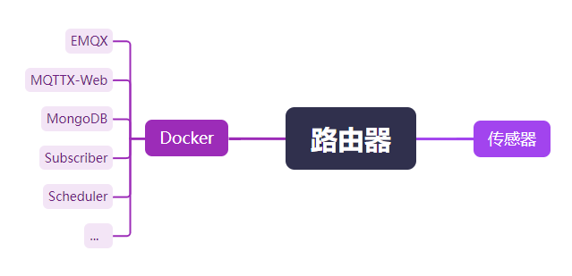

# HomeSensor

该项目通过 MQTT 协议来收集传感器数据，通过各种条件控制传感器。

目前已实现使用功能：  

 - ESP-WROOM-32E 连接 GY-302 与 BME280 来测量阳台的光照强度，温度，湿度，气压，并且通过 Subscriber 模块根据日出日落时间控制是否采集光照强度数据

### 模块

 - [Subscriber](https://github.com/WangZhiYao/HomeSensor-Subscriber)：数据收集：收集并记录传感器的数据，便于监控和分析 
 - [Scheduler](https://github.com/WangZhiYao/HomeSensor-Scheduler)：传感器调度：根据各种规则更改传感器配置，发布事件通知 
 - [Controller](https://github.com/WangZhiYao/HomeSensor-Controller)：控制器：根据 Scheduler 发布的事件通知控制传感器
 - [IoT](https://github.com/WangZhiYao/HomeSensor-IoT)：控制房间内的智能设备

### TODO
 - [x]  更多传感器：集成更多传感器（例如，温度、湿度、气压）以扩展监控能力。
 - [ ]  数据可视化：开发一个移动应用与配套后台，以实时可视化收集到的数据并且可以控制传感器配置。
 - [x]  自动化：添加一个控制模块，根据传感器数据实现自动化规则（例如，根据光照强度控制植物补光灯的开关）。
