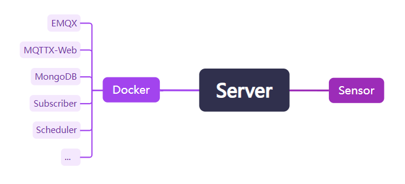

# HomeSensor

该项目通过 MQTT 协议来控制家庭环境中的各种传感器，收集这些传感器上传的数据。  
目前，我已经实现了使用 ESP-WROOM-32E 微控制器连接 GY-302 传感器来测量阳台的光照强度。

### 功能
 - 传感器控制：管理和控制家中的各种传感器 [Scheduler](https://github.com/WangZhiYao/HomeSensor-Scheduler)。
 - 数据收集：收集并记录传感器的数据，便于监控和分析 [Subscriber](https://github.com/WangZhiYao/HomeSensor-Subscriber)。

### TODO
 - [ ]  更多传感器：集成更多传感器（例如，温度、湿度、运动）以扩展监控能力。
 - [ ]  数据可视化：开发一个移动应用与配套后台，以实时可视化收集到的数据并且可以控制传感器配置。
 - [ ]  自动化：添加一个控制模块，根据传感器数据实现自动化规则（例如，根据光照强度控制植物补光灯的开关）。
